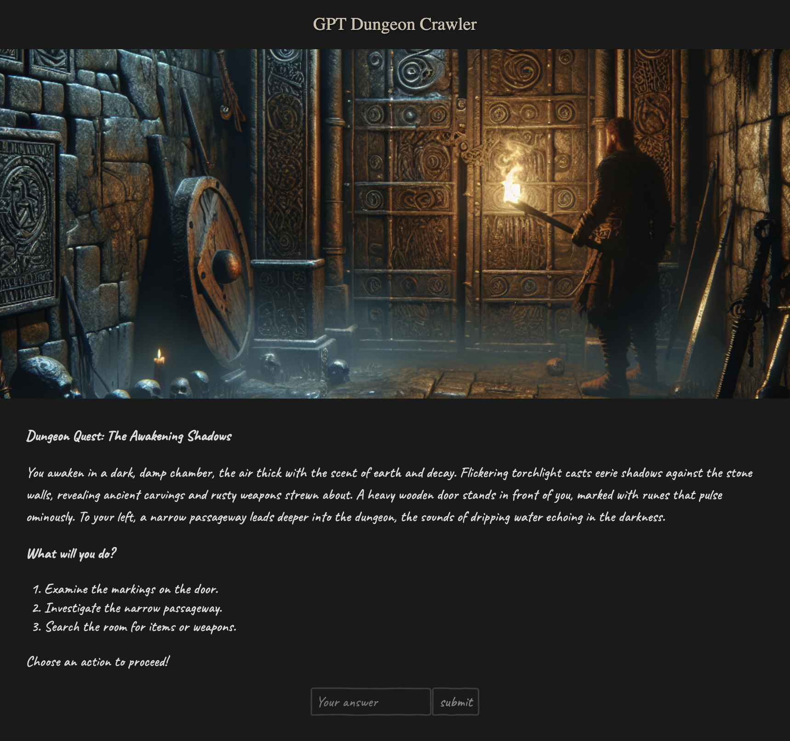

# GPT Dungeon Crawler

This project is powered by [`create-svelte`](https://github.com/sveltejs/kit/tree/main/packages/create-svelte) and [Open AI](https://openai.com/). 
It is a simple text-based dungeon crawler with the story and images generated by Open AI API. 

## Usage

In order to run the code you will need to provide your Open AI API key by creating a `.env` file and adding the key there:
```bash
OPENAI_API_KEY={YOUR_KEY}
```

## Running

To run the project install the packages and run `dev`, e.g.:
```bash
npm run install
npm run dev

# or 
yarn install
yarn dev
```

## Examples



Each page has a story and an input to proceed based on the input choice. If at any point you want to restart submit no 
answer (blank) and the dungeon will restart from the beginning.
More example images of a generated story can be found in the [examples](examples) folder. 